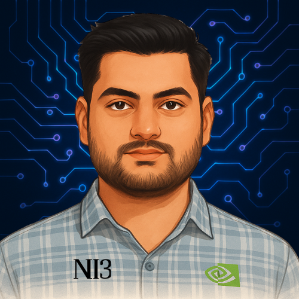

<!-- # My Awesome Portfolio Website

This repository contains the source code for my personal portfolio website, showcasing my projects, skills, and experience. It's built with [mention your primary technology, e.g., HTML, CSS, JavaScript, React, Angular, Vue, etc.].

Currently, the project is structured to highlight:

- **Projects:** A collection of my key development work.
- **Skills:** An overview of my technical competencies.
- **About Me:** A little bit about my background and passion for development.
- **Contact:** Ways to get in touch with me.
- **Education and Experience:** Detail about my education and industry expericence.

## Technologies Used

This project leverages a modern tech stack to deliver a responsive and engaging user experience:

- **Frontend:** [React, Next.js, Vanilla JS, HTML5, CSS3, SASS]
- **Styling:** [Tailwind CSS, Material UI, Styled Components, custom CSS]
- **Version Control:** Git & GitHub
- **Deployment:** Loading....
- **Other Tools:** Vite

## Getting Started

If you'd like to run this project locally, follow these steps:

1.  **Clone the repository:**
    ```bash
    git clone [https://github.com/YourUsername/YourRepositoryName.git](https://github.com/YourUsername/YourRepositoryName.git)
    cd YourRepositoryName
    ```
2.  **Install dependencies (if any):**
    ```bash
    # Example for npm
    npm install
    # Example for yarn
    yarn install
    ```
3.  **Run the development server (if applicable):**
    ```bash
    # Example for npm
    npm run dev
    # Example for yarn
    yarn dev
    ```
    Open [http://localhost:3000](http://localhost:3000) (or the port specified) in your browser.

## Future Enhancements (Optional)

I plan to continue developing this portfolio by:

- Adding more project details and case studies.
- Implementing a blog section.
- Optimizing for performance and accessibility further.

 -->

<!-- LOGO -->
<p align="center">
  
</p>

<h1 align="center">Nitin Singh - Personal Portfolio</h1>

<p align="center">
  Welcome to the repository for my personal portfolio website! This project showcases my skills, projects, and journey as a software developer.
  <br />
  <a href="[https://portfolio-nitinsingh.vercel.app/]"><strong>View Live Demo »</strong></a>
  <br />
  <br />
  <a href="https://github.com/NI3singh/Portfolio/issues">Report Bug</a>
  ·
  <a href="https://github.com/NI3singh/Portfolio/issues">Request Feature</a>
</p>

<!-- ABOUT THE PROJECT -->
## 🚀 About The Project

This portfolio is a single-page application built with modern web technologies to provide a fast, responsive, and visually appealing experience. It serves as a central hub for my professional work, including detailed project descriptions, my resume, and ways to get in touch with me.

### ✨ Features
*   **Responsive Design:** Looks great on all devices, from mobile phones to desktops.
*   **Interactive UI:** Smooth animations and transitions for an engaging user experience.
*   **Project Showcase:** A dedicated section to display my work with links to live demos and source code.
*   **Contact Form:** An easy way for visitors to reach out to me.
*   **Analytics:** Integrated with Google Analytics to track visitor engagement.

### 🛠️ Built With

This project is built with a modern and robust tech stack:

*   
*   
*   
*    <!-- Or replace with CSS3/Sass if you used that -->
*   

<!-- CONTACT -->
## 📬 Connect with me

Nitin Singh - @[your_linkedin_profile](https://www.linkedin.com/in/nitinsinghr/) - ni3.singh.r@gmail.com


